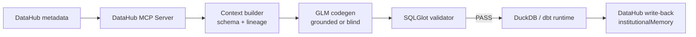

# Hallucination-Proof SQL Codegen

Bare LLMs can generate plausible-looking data code that references columns which
do not exist. This project grounds `z-ai/glm-5.2` with real DataHub schema and
lineage retrieved through the DataHub MCP Server, validates every physical
column reference with SQLGlot, and writes generation provenance back to
DataHub. The result is dbt SQL that can run correctly on the first attempt
instead of failing later in the warehouse.

## The proof: same model, same task, one controlled difference

Both runs used the same model and this exact task:

> 幫我算出顧客終身價值的分布狀況，把顧客分成 5 個等量的區間，列出每個區間的人數、最低、平均、最高值

The only difference was whether GLM received the DataHub context bundle.

| Mode | Context supplied to GLM | Generated source field | Validator | DuckDB runtime |
| --- | --- | --- | --- | --- |
| Blind | Table name `customers` only | `clv` | **FAIL** — `clv` is not in the schema | **Binder Error:** `Referenced column "clv" not found in FROM clause!` |
| Grounded | 7 real fields plus upstream lineage | `customer_lifetime_value` | **PASS** | **Success:** 100 customers returned in 5 buckets of 20 |

DuckDB also suggested the correct binding in the blind failure:
`Candidate bindings: "customer_lifetime_value"`.

This is runtime evidence, not an AI-written claim:

- [Blind SQL](examples/output_blind.sql) and
  [DuckDB error](examples/blind_runtime_error.txt)
- [Grounded SQL](examples/output_grounded.sql) and
  [DuckDB output](examples/grounded_runtime_output.txt)
- [Shared task](examples/task.txt)

## How the pipeline works



1. `context_builder.py` calls MCP `search`, follows schema pagination until
   `remainingCount` reaches zero, then retrieves one-hop upstream lineage.
2. `codegen.py` injects that context into the grounded system prompt. Its
   `--blind` mode uses the same model and task but provides only the table name.
3. `validator.py` parses dbt SQL with SQLGlot and compares physical source
   columns with DataHub's authoritative `fieldPath` values.
4. `writeback.py` appends the validated generation evidence to the dataset's
   `institutionalMemory`, reads it back from GMS, and verifies that the original
   ingestion-owned description was preserved.

The checked-in `customers` context contains all 7 schema fields and shows that
the model is derived from three upstream tables: `stg_customers`, `stg_orders`,
and `stg_payments`. That lineage is information a model cannot reliably infer
from the table name alone.

## Automated validator evidence

The validator distinguishes physical columns from valid CTE and SELECT aliases,
including references nested inside window functions.

| Test | Expected and observed result | Hallucinated columns | Exit code |
| --- | --- | --- | --- |
| Grounded SQL | **PASS** | None | `0` |
| Blind SQL | **FAIL** | `clv` | `1` |
| Window-only edge case: `NTILE(5) OVER (ORDER BY clv) AS clv_band` | **FAIL** | `clv`; derived alias `clv_band` is not misclassified | `1` |

Run the three checked-in cases:

```powershell
python src/validator.py examples/output_grounded.sql
python src/validator.py examples/output_blind.sql
python src/validator.py examples/validator_window_edge.sql
```

Each command prints structured JSON. Exit code `0` means all physical source
columns are valid, `1` means unsupported columns or tables were detected, and
`2` means parsing or configuration failed. The non-zero validation result is
ready for CI or another automated agent gate.

## Closed-loop write-back

After validation and DuckDB execution passed, `writeback.py` wrote a provenance
record to the real dbt `customers` dataset through `DatahubRestEmitter`. API
read-back confirmed that the `institutionalMemory` element exists and that the
original dbt description did not change. The same record was then verified
visually in DataHub under **Documentation → Resources**:


The resource links directly to
[`examples/output_grounded.sql`](examples/output_grounded.sql), so reviewers can
move from the metadata record to the exact generated artifact.

## Repository layout

```text
hallucination-proof-codegen/
|-- src/
|   |-- context_builder.py
|   |-- codegen.py
|   |-- validator.py
|   `-- writeback.py
|-- examples/
|   |-- context_bundle.json
|   |-- task.txt
|   |-- output_blind.sql
|   |-- blind_runtime_error.txt
|   |-- output_grounded.sql
|   |-- grounded_runtime_output.txt
|   |-- validator_window_edge.sql
|   |-- writeback_ui_evidence.png
|   `-- README.md
|-- .env.example
|-- .gitignore
|-- LICENSE
`-- requirements.txt
```

The dbt Labs test project is intentionally not vendored into this repository.

## Quick start

### 1. Install this project

```powershell
git clone https://github.com/mangroveuniversemu-bot/hallucination-proof-codegen.git
cd hallucination-proof-codegen
python -m venv .venv
.\.venv\Scripts\Activate.ps1
python -m pip install -r requirements.txt
Copy-Item .env.example .env
```

Set the NVIDIA API key in `.env`. The local DataHub URLs are already represented
in `.env.example`; `DATAHUB_GMS_TOKEN` can remain empty for an unsecured local
Quickstart instance.

```dotenv
NVIDIA_API_KEY=your_key_here
DATAHUB_GMS_URL=http://localhost:8080
DATAHUB_UI_URL=http://localhost:9002
DATAHUB_GMS_TOKEN=
```

Never commit `.env`; it is ignored by Git.

### 2. Prepare the external dbt test dataset

Clone the dbt Labs project next to this repository:

```powershell
git clone https://github.com/dbt-labs/jaffle_shop_duckdb.git ..\jaffle_shop_duckdb
cd ..\jaffle_shop_duckdb
dbt build
dbt docs generate
cd ..\hallucination-proof-codegen
```

Ingest the generated DuckDB and dbt metadata into DataHub, and ensure the
`mcp-server-datahub` command can connect to that instance. The captured
`examples/context_bundle.json` is included as evidence, but rebuilding context
requires a running DataHub instance.

### 3. Build authoritative context

```powershell
python src/context_builder.py customers
```

The command writes `examples/context_bundle.json` with the complete paginated
field list and immediate upstream tables.

### 4. Generate the controlled Before/After pair

```powershell
$task = Get-Content -Raw .\examples\task.txt
python src/codegen.py $task
python src/codegen.py --blind $task
```

Outputs are written to `examples/output_grounded.sql` and
`examples/output_blind.sql`.

### 5. Validate both outputs

```powershell
python src/validator.py examples/output_grounded.sql
python src/validator.py examples/output_blind.sql
```

### 6. Execute both outputs against DuckDB

```powershell
$sql = Get-Content -Raw .\examples\output_blind.sql
dbt --project-dir ..\jaffle_shop_duckdb --profiles-dir ..\jaffle_shop_duckdb show --inline $sql --limit 10

$sql = Get-Content -Raw .\examples\output_grounded.sql
dbt --project-dir ..\jaffle_shop_duckdb --profiles-dir ..\jaffle_shop_duckdb show --inline $sql --limit 10
```

### 7. Write validated provenance back to DataHub

```powershell
python src/writeback.py `
  "Grounded SQL generated from DataHub schema; SQLGlot validation and DuckDB execution both passed." `
  --task "Calculate the customer lifetime-value distribution in five equal-sized buckets and report count, minimum, average, and maximum."
```

The command reads the dataset URN from `examples/context_bundle.json`, appends
the evidence without replacing existing documentation, verifies the write via
GMS, and prints the direct DataHub UI URL.

## License

Licensed under the [Apache License 2.0](LICENSE).
