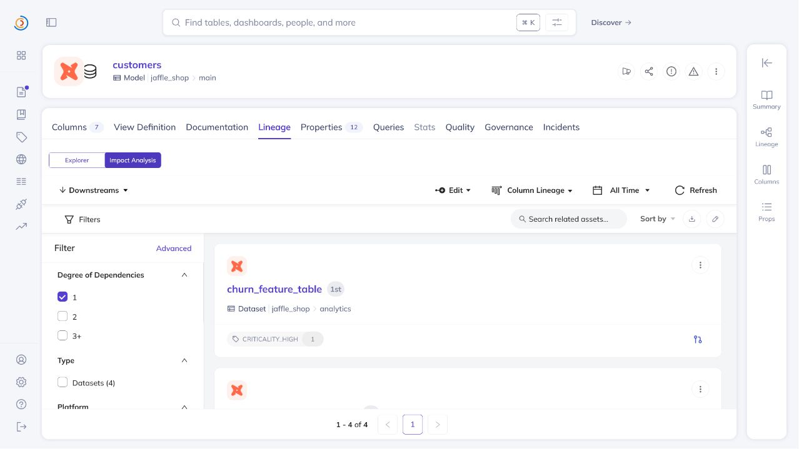
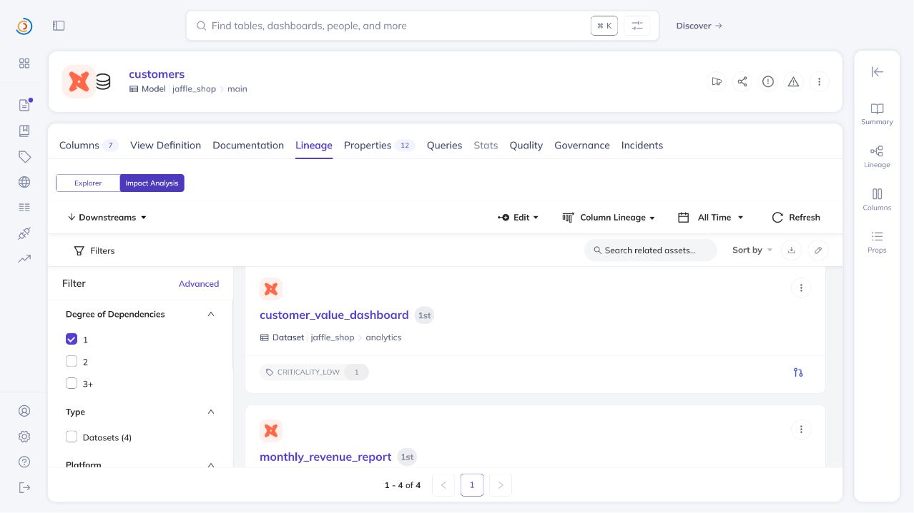
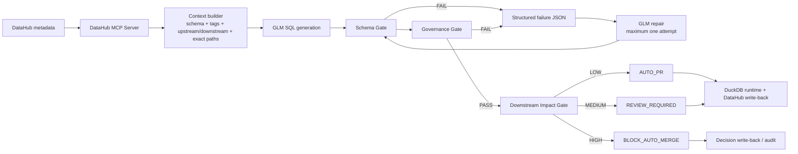
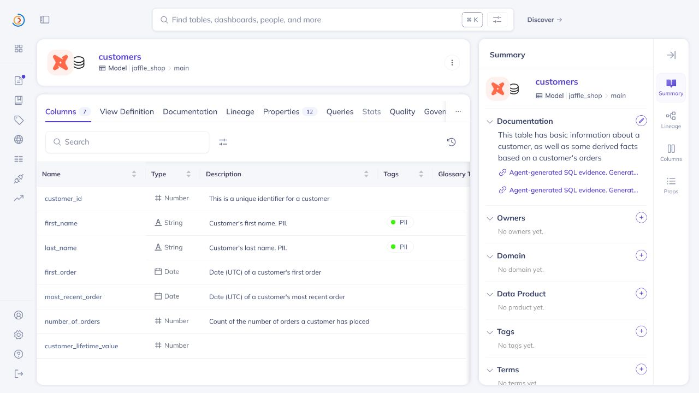

# Hallucination-Proof SQL Codegen

**SQL that runs is not necessarily SQL that should be merged.**

This project turns DataHub metadata into a change-admission control plane for
agent-generated dbt SQL. `z-ai/glm-5.2` receives real schema and lineage, while
deterministic gates enforce source columns, field-level PII policy, and
downstream criticality. A failed candidate may receive exactly one structured
GLM repair attempt; the result is then passed, routed to review, or blocked.

This is more than a metadata-aware code generator:

- DataHub MCP supplies authoritative schema, upstream/downstream lineage,
  field tags, asset criticality, and exact lineage paths.
- SQLGlot traces final outputs through CTEs, aliases, expressions, stars, and
  window functions to physical source columns.
- PII policy blocks executable-but-unsafe SQL.
- Downstream criticality converts lineage into `AUTO_PR`, `REVIEW_REQUIRED`,
  or `BLOCK_AUTO_MERGE`.
- Repair is bounded to one attempt. Provider failure or a second gate failure
fails closed instead of starting an agent loop.

The repository name describes the design goal, not a claim that hallucinations
have been eliminated. Evidence is reported as gate outcomes on named tasks.

## Three controlled proofs

### 1. Schema grounding prevents hallucinated columns

Both runs use the same model and task. The only difference is whether GLM
receives the DataHub context bundle.

| Mode | Context supplied | Generated field | Schema gate | DuckDB runtime |
| --- | --- | --- | --- | --- |
| Blind | Table name `customers` only | `clv` | **FAIL** | **Binder Error** |
| Grounded | 7 real fields plus lineage | `customer_lifetime_value` | **PASS** | **PASS:** 5 buckets of 20 |

DuckDB suggested the real field in the blind failure:
`Candidate bindings: "customer_lifetime_value"`.

Evidence:

- [Shared task](examples/task.txt)
- [Blind SQL](examples/output_blind.sql) and
  [runtime error](examples/blind_runtime_error.txt)
- [Grounded SQL](examples/output_grounded.sql) and
  [runtime output](examples/grounded_runtime_output.txt)

### 2. The PII Governance Gate blocks executable-but-unsafe SQL

DataHub classifies `first_name` and `last_name` with field-level `PII` tags.
The candidate asks for CLV segmentation and customer names.

| Gate | Candidate | After repair |
| --- | --- | --- |
| Schema | **PASS**: every field exists | **PASS** |
| DuckDB runtime | **PASS**: query returns names | **PASS**: segmentation remains |
| Governance | **FAIL**: PII reaches final output | **PASS**: PII projections removed |

The failure is a policy decision, not a disguised SQL error.

Evidence:

- [Unsafe candidate SQL](examples/output_pii_candidate.sql)
- [Governance failure](examples/governance_fail.json)
- [Deterministic AST repair](examples/governance_repair.json)
- [Repaired SQL](examples/output_pii_repaired.sql)
- [Final governance pass](examples/governance_pass.json)
- [Candidate runtime](examples/pii_candidate_runtime_output.txt) and
  [repaired runtime](examples/pii_repaired_runtime_output.txt)

### 3. Downstream lineage controls admission

The local demo bootstrap creates three explicitly demo-managed downstream
datasets in DataHub, connects them to `customers`, and applies criticality tags.
The gate does not hardcode their names: it reads them back through MCP and
verifies an exact lineage path for every consumer.

| DataHub downstream consumer | Criticality | Required action |
| --- | --- | --- |
| `customer_value_dashboard` | LOW | `AUTO_PR` |
| `monthly_revenue_report` | MEDIUM | `REVIEW_REQUIRED` |
| `churn_feature_table` | HIGH | `BLOCK_AUTO_MERGE` |

The highest reachable criticality wins, so the checked-in result blocks
automatic merge. The dbt-to-DuckDB physical sibling is retained as lineage
evidence but excluded from the business-impact decision.

Evidence:

- [DataHub-derived context](examples/context_bundle.json)
- [Impact policy](policies/impact_policy.json)
- [Impact report](examples/impact_report.json)
- [Full admission report](examples/admission_report.json)
- [One-attempt GLM repair](examples/output_agent_repaired.sql) and
  [DuckDB runtime](examples/agent_repair_runtime_output.txt)





## Small Verified Merge Readiness benchmark

The checked-in benchmark tests three controlled schema worlds with three tasks
each. Every mode sees the same task and fixed DuckDB rows.

| World | What it isolates |
| --- | --- |
| Familiar | Conventional names such as `orders.total_amount` |
| Legacy | Non-obvious names such as `fct_cart_checkouts.gross_revenue_usd` |
| Governed | Legacy-style names plus field-level `PII` / `RESTRICTED` metadata |

There are only two initial model calls per task: Blind and DataHub Context.
Context + Assurance reuses the exact Context candidate and may make one repair
call only after a gate failure. It never gets a fresh initial sample.

**Verified Merge Readiness (VMR)** is the share of all nine task generations
that pass schema, DuckDB runtime, governance, and reference-result gates.

| Mode | Ready | VMR | Schema | Runtime | Governance | Result | Repairs |
| --- | ---: | ---: | ---: | ---: | ---: | ---: | ---: |
| Blind | 1/9 | 11.1% | 11.1% | 11.1% | 11.1% | 11.1% | 0 |
| DataHub Context | 7/9 | 77.8% | 100% | 100% | 77.8% | 77.8% | 0 |
| Context + Assurance | 9/9 | 100% | 100% | 100% | 100% | 100% | 2/2 passed |

These are small-sample, directional results from one recorded run of
`z-ai/glm-5.2`; **they are not evidence that hallucinations were reduced to
zero**. The full report retains every SQL file and failed gate in the
denominator. Result validation executes a reference query over the same fixed
data and compares ordered column names, row counts, and values.

The first scoring pass also exposed two defects in the gates themselves: CTE
`SELECT *` output forwarding and `COUNT(*)` lineage. Both were fixed with
regression tests, then the exact existing SQL was rescored with no new model
calls. Before those defects were identified, the run made one unnecessary
Legacy repair call; that output is retained as a discarded debugging artifact
and is not used in the final score. The run metadata therefore records 18
initial calls, 3 repair calls, and 2 repair outputs used for scoring.

Evidence:

- [Human-readable benchmark result](examples/benchmark_results.md)
- [Machine-readable summary](examples/benchmark_summary.json)
- [Full per-generation report](benchmarks/results/20260727T120000Z/report.json)
- [World/task definition](benchmarks/worlds.json) and
  [DataHub-shaped context fixtures](benchmarks/contexts/)

## Architecture



There is no unlimited repair cycle. A repaired candidate is evaluated once;
if it still fails, or if the provider errors, admission is blocked.

## How each stage works

1. `context_builder.py` searches for an exact dbt dataset name, paginates all
   schema fields, reads immediate upstream lineage, explores downstreams to
   three hops, and calls `get_lineage_paths_between` for each result.
2. `codegen.py` exposes field descriptions and governance labels to the
   grounded prompt. `--blind` supplies only the table name.
3. `validator.py` checks physical references against DataHub `fieldPath`
   values while excluding valid derived aliases.
4. `governance_gate.py` traces final output lineage and applies the versioned
   PII policy. Its standalone `--repair` mode is a deterministic AST rewrite.
5. `impact_gate.py` maps real downstream criticality to an admission action.
   Unknown criticality defaults to reviewer; unverified paths cannot auto-PR.
6. `admission_controller.py` converts a schema/governance failure to JSON,
   sends that JSON and the original SQL to GLM once, re-runs both gates, then
   applies downstream impact admission.
7. `writeback.py` appends evidence to DataHub `institutionalMemory`, reads it
   back, and confirms the ingestion-owned description is unchanged.
8. `benchmark.py` runs the paired three-world experiment, executes all four
   gates, preserves raw SQL, and computes VMR without dropping failures.

The checked-in `customers` context contains all 7 fields, three upstream
tables (`stg_customers`, `stg_orders`, `stg_payments`), verified PII tags, and
the downstream admission graph.

## Structured bounded repair

The controller sends a machine-readable report rather than relying on a human
to copy terminal output:

```json
{
  "gate": "governance",
  "status": "BLOCK",
  "violations": [
    {
      "field": "customers.last_name",
      "classification": ["PII"],
      "allowed_actions": ["exclude"]
    }
  ],
  "repair_attempts_allowed": 1
}
```

The current policy permits `exclude`. It intentionally does not claim that an
unsalted hash of a name is safe. A production-approved tokenization or salted
hash UDF can be added as an allowed action when policy metadata defines it.

## Automated test evidence

The suite covers governance lineage, CTEs, aliases, stars, `COUNT(*)`, window functions,
exact dataset selection, representation-copy filtering, LOW/MEDIUM/HIGH
routing, unknown criticality, unverified paths, one-call repair, failed repair,
provider timeout behavior, reference-answer preflight, and ordered result
equivalence.

```powershell
python -m unittest discover -s tests -v
```

CLI exit codes are automation-ready:

| Result | Exit code |
| --- | --- |
| Pass / `AUTO_PR` | `0` |
| Policy block / `BLOCK_AUTO_MERGE` | `1` |
| Configuration or execution error | `2` |
| `REVIEW_REQUIRED` | `3` |

## Closed-loop DataHub evidence

The UI confirms both field-level PII tags and agent evidence links while the
original dbt description remains intact.



## Repository layout

```text
hallucination-proof-codegen/
|-- src/
|   |-- context_builder.py
|   |-- codegen.py
|   |-- validator.py
|   |-- governance_gate.py
|   |-- impact_gate.py
|   |-- admission_controller.py
|   |-- bootstrap_governance.py
|   |-- bootstrap_impact_demo.py
|   |-- benchmark.py
|   `-- writeback.py
|-- benchmarks/
|   |-- contexts/
|   |-- results/20260727T120000Z/
|   `-- worlds.json
|-- policies/
|   |-- pii_direct_projection.json
|   `-- impact_policy.json
|-- tests/
|   |-- test_governance_gate.py
|   |-- test_context_builder.py
|   |-- test_impact_gate.py
|   |-- test_admission_controller.py
|   |-- test_validator.py
|   `-- test_benchmark.py
|-- examples/
|   |-- context_bundle.json
|   |-- output_pii_candidate.sql
|   |-- output_agent_repaired.sql
|   |-- impact_report.json
|   |-- admission_report.json
|   `-- *_ui_evidence.png
|-- .env.example
|-- .gitignore
|-- LICENSE
`-- requirements.txt
```

The dbt Labs test project is intentionally not vendored into this repository.

## Quick start

### 1. Install

```powershell
git clone https://github.com/mangroveuniversemu-bot/hallucination-proof-codegen.git
cd hallucination-proof-codegen
python -m venv .venv
.\.venv\Scripts\Activate.ps1
python -m pip install -r requirements.txt
Copy-Item .env.example .env
```

Set `NVIDIA_API_KEY` in `.env`. Never commit `.env`.

### 2. Prepare the external dbt dataset

```powershell
git clone https://github.com/dbt-labs/jaffle_shop_duckdb.git ..\jaffle_shop_duckdb
Push-Location ..\jaffle_shop_duckdb
dbt build
dbt docs generate
Pop-Location
```

Ingest the DuckDB and dbt artifacts into a local DataHub instance.

### 3. Build authoritative context

```powershell
python src/context_builder.py customers
```

### 4. Apply and verify PII metadata

```powershell
python src/bootstrap_governance.py
```

### 5. Create the transparent demo impact graph

```powershell
python src/bootstrap_impact_demo.py
```

This command is idempotent. It creates only the three assets documented above,
marks each with `demo_managed_by=hallucination-proof-codegen`, and updates the
context only after MCP reads back tags and exact paths.

### 6. Run the standalone impact gate

```powershell
python src/impact_gate.py --report-output examples/impact_report.json
```

The checked-in demo exits `1` because one reachable asset is HIGH.

### 7. Run the bounded admission controller

```powershell
python src/admission_controller.py examples/output_pii_candidate.sql `
  --task "Create a five-bucket customer lifetime-value segmentation model and include customer names." `
  --repair-output examples/output_agent_repaired.sql `
  --report-output examples/admission_report.json
```

The controller performs at most one GLM call. In the checked-in result the
repair passes schema and governance, then downstream impact blocks auto-merge.

### 8. Verify repaired SQL against DuckDB

The sample profile uses a relative DuckDB path, so run from the dbt project:

```powershell
Push-Location ..\jaffle_shop_duckdb
$sql = Get-Content -Raw `
  ..\hallucination-proof-codegen\examples\output_agent_repaired.sql
dbt show --project-dir . --profiles-dir . --inline $sql --limit 5
Pop-Location
```

### 9. Write a decision record back to DataHub

```powershell
python src/writeback.py `
  "One GLM repair passed schema and governance; HIGH downstream criticality blocked automatic merge." `
  --task "Create a five-bucket CLV model and include customer names." `
  --evidence-url "https://github.com/mangroveuniversemu-bot/hallucination-proof-codegen/blob/main/examples/admission_report.json"
```

### 10. Reproduce the small benchmark

This makes 18 initial model calls and only the repair calls required by failed
Context candidates. It creates a timestamped directory under
`benchmarks/results/`.

```powershell
python src/benchmark.py --workers 3
```

To re-evaluate an existing run after changing deterministic gates, without any
new model call:

```powershell
python src/benchmark.py --rescore-run 20260727T120000Z
```

## License

Licensed under the [Apache License 2.0](LICENSE).
